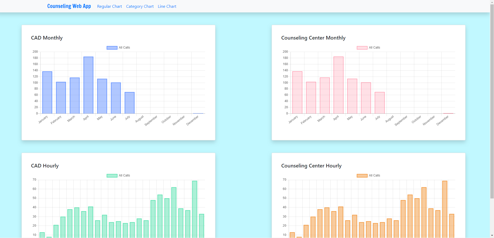

# CounselingWebApp
Retrieve call information from database to track and record calls to GTPD dispatch and counseling center

To run the application, run the command `npm run dev` in the root directory and open up localhost:3000

##Screenshots

.png)
.png)
.png)